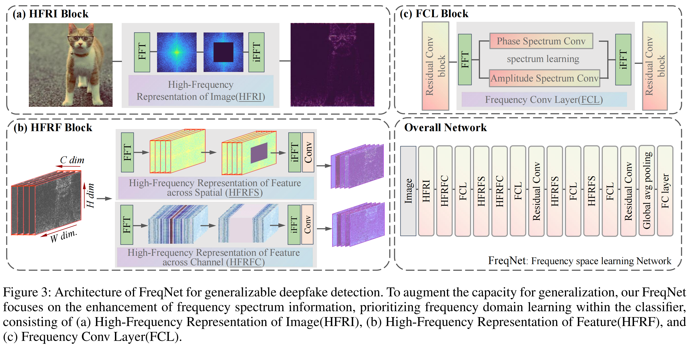

# Frequency-Aware Deepfake Detection: Improving Generalizability through Frequency Space Domain Learning

<p align="center">
	<br>
	Beijing Jiaotong University, YanShan University, A*Star
</p>



Reference github repository for the paper [Frequency-Aware Deepfake Detection: Improving Generalizability through Frequency Space Domain Learning](https://arxiv.org/abs/2403.07240). FreqNet is accepted by AAAI 2024!
```
@misc{tan2024frequencyaware,
      title={Frequency-Aware Deepfake Detection: Improving Generalizability through Frequency Space Learning}, 
      author={Chuangchuang Tan and Yao Zhao and Shikui Wei and Guanghua Gu and Ping Liu and Yunchao Wei},
      year={2024},
      eprint={2403.07240},
      archivePrefix={arXiv},
      primaryClass={cs.CV}
}
```

### TODO
- [ ] Random seed setting ensures reproducibility of results.
- ~~[ ] Pre-Trained Model release~~
- ~~[ ] Update link to paper~~ 
- ~~[ ] Pretrained models~~ 
- ~~[ ] Dataset download~~ 
- ~~[ ] Code released~~

## Environment setup
**Classification environment:** 
We recommend installing the required packages by running the command:
```sh
pip install -r requirements.txt
```

## Getting the data
Download dataset from [CNNDetection CVPR2020](https://github.com/peterwang512/CNNDetection),  [GANGen-Detection](https://github.com/chuangchuangtan/GANGen-Detection) ([googledrive](https://drive.google.com/drive/folders/11E0Knf9J1qlv2UuTnJSOFUjIIi90czSj?usp=sharing)).
```
pip install gdown==4.7.1

chmod 777 ./download_dataset.sh

./download_dataset.sh
```

## Training the model 
```sh
CUDA_VISIBLE_DEVICES=0 python train.py --name 4class-resnet-car-cat-chair-horse --dataroot {CNNDetection-Path} --classes car,cat,chair,horse --batch_size 32 --delr_freq 10 --lr 0.001 --niter 85
```
#### GPU Server information
```
Our GPU Server information is as follows:(Paper results)
CPU : Hygon C86 7169 24-core Processor
GPU : A4000
Nvidia Driver : 495.29.05
Ubuntu Version: 20.04.1 LTS
```

## Testing the detector
Modify the dataroot in test.py.
```sh
CUDA_VISIBLE_DEVICES=0 python test.py --model_path ./4-classes-freqnet.pth  --batch_size {BS}
```
<!-- 
## Detection Results
-->

## Acknowledgments

This repository borrows partially from the [CNNDetection](https://github.com/peterwang512/CNNDetection), [NPR](https://github.com/chuangchuangtan/NPR-DeepfakeDetection).
